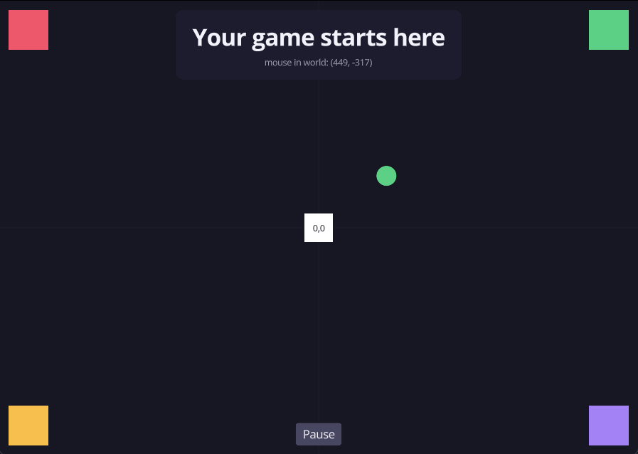

# Moonshot Game Template

Template for creating games with the [Moonshot](https://github.com/jfraper/moonshot) engine.



`src/main.cpp` starts as a map of where the coordinates go: a `draw_*` square in each screen corner
and one on the origin, a circle orbiting it off `dt`, and a `ui::` panel with the mouse read back in
world coordinates and a button that pauses the orbit. Between them they cover the primitives, text,
UI layout, a widget you can click and state that survives across frames. Its header comment is the
short version of the section below. Delete it and write your game

## Quick Start

```bash
# 1. Create your project from this template
gh repo create my-game --template jfraper/moonshot-template --clone
cd my-game

# 2. Initialize the engine submodule
git submodule update --init --recursive

# 3. Build and run
./scripts/build.sh --run
```

## Setup

1. Rename the project in `CMakeLists.txt` (change `mygame` to your project name)
2. Edit `src/main.cpp` to set your game title and window size
3. Put game assets in `assets/`
4. Optional: drop a 1024x1024 `icon.png` in the project root and it becomes the app and window icon

## Coordinate Systems

The single thing worth knowing before drawing anything. `src/main.cpp` demonstrates all of it, and
its header comment is the long version

| | Origin | +Y | Units | Anchored by |
|---|---|---|---|---|
| `draw_*` | centre of the window | up | design pixels | the quad's pivot, centre by default |
| `ui::` | centre of the window | up | design pixels | the pivot passed to `Position::absolute` |
| `input::get_mouse_position()` | bottom-left | up | real window points | n/a |

`draw_*` and `ui::` share one space, so the same numbers mean the same place in both. Convert the
mouse with `graphics::screen_to_world(renderer, input::get_mouse_position())` before hit-testing

Two boxes that are not the same size. `window::get_size_ref()` is the fixed design box you set in
`game_configure`. `graphics::get_visible_rect(renderer).size` is what the window actually shows,
which grows on the short axis when the aspect ratio stops matching, because under the default
`ScaleMode::FIT` that extra room is real world rather than dead letterbox. Position from the visible
rect what must hug the true window edge, and from the design box what belongs to a fixed layout.
**Which box you pick is independent of which API you draw with**: a `draw_*` call measured from the
design box stays pinned to it exactly as a `ui::` element does

**A renderer with no camera renders through an identity projection**, which reinterprets every
coordinate as NDC and throws the scene off screen. `set_camera` is mandatory, and the `Camera2D` must
outlive the renderer because only its address is stored

```cpp
static Renderer         renderer;
static camera::Camera2D cam;   // must outlive the renderer

GAME_API void game_init(void* saved, u64 size) {
  init_renderer(renderer);
  set_camera(renderer, cam);   // not optional
}
```

## Scripts

| Command | Description |
|---------|-------------|
| `./scripts/build.sh --run` | Debug build and run (with hot reload) |
| `./scripts/build.sh --release --run` | Release build and run |
| `./scripts/build.sh --clean --run` | Clean rebuild |
| `./scripts/build.sh --update-engine` | Update engine to latest version |
| `./scripts/run.sh` | Run last build |

## Project Structure

```
my-game/
  engine/          # Moonshot engine (git submodule)
  src/
    main.cpp       # Game entry point
  assets/          # Game assets (textures, sounds, etc.)
  scripts/         # Build and run scripts
  dist/            # Build output (auto-generated)
```

Debug builds produce a hot-reload launcher (`<project>.out`). Release builds produce a plain
executable, except on macOS where the game is packaged as `<project>.app` — the bundle is what
gives it a Dock icon, its name in the menu bar and a path to notarization. `./scripts/run.sh`
handles both.

## Updating the Engine

```bash
# Update to latest engine
./scripts/build.sh --update-engine

# Or pin to a specific version
cd engine
git checkout v0.37.0
cd ..
git add engine
git commit -m "pin engine to v0.37.0"
```
